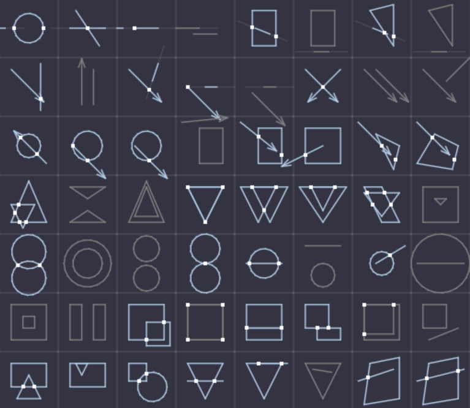

# geo2d.lua

`geo2d.lua` is a 2D Computational Geometry library written in pure Lua. It provides a set of geometric functions in 2D space, focusing on common shapes such as AABBs, circles, lines, rays, curves, and polygons. It supports shape intersection tests, closest point calculations, geometric transformations, polygon triangulation and clipping, random point generation, and many other features. For the full API please see [api.md](doc/api.md).

Sections of this library are ported into Lua from Arash Partow's [Wykobi Computational Geometry Library](https://github.com/ArashPartow/wykobi).

Some of the design principles of the library are:
* Prefer multiple parameters and return values over tables
* When tables are used, prefer flat-arrays (e.g., polygons are a table in the form `[x1, y1, ..., xn, yn]`)
* Provide a *debug* version that performs additional sanity checks


## Installation

Copy the `geo2d.lua` file from one of the distributions in `dist/` (e.g., [lua51](dist/lua51/geo2d.lua)) into your project and then `require` it:

```lua
local geo2d = require "geo2d"
if geo2d.intersect_aabb_line(...) then
	...
end
```

When using a distribution like [picotron](dist/picotron/geo2d.lua) you can use `include` instead and the functions will be added to a `geo2d` global:

```lua
include 'geo2d.lua'
local ax, ay, bx, by = geo2d.clip_segment_aabb(...)
```

## Examples

Some examples are provided below.

```lua
local geo2d = require "geo2d"

do
	-- Measure area, centroid and length of 3 shapes
	geo2d.area_triangle(0, 0, 1, 0, 0, 1) -- (x1, y1, x2, y2, x3, y3)
	geo2d.centroid_polygon({0, 0, 0, 1, 0, 2, 1, 2, 1, 1, 1, 0}) -- (table of x,y points of a polygon)
	geo2d.length_polyline({0, 0, 0, 1, 0, 2, 1, 2, 1, 1, 1, 0, 0, 0}) -- (table of x,y points of a polyline)
end

do
	-- Compute union of the AABBs of a circle and triangle
	local cmin_x, cmin_y, cmax_x, cmax_y = geo2d.aabb_circle(0, 0, 2) -- (center_x, center_y, radius)
	local tmin_x, tmin_y, tmax_x, tmax_y = geo2d.aabb_triangle(0, 0, 1, 0, 1, 1)  -- (x1, y1, x2, y2, x3, y3)
	local union = geo2d.aabb_union(cmin_x, cmin_y, cmax_x, cmax_y, tmin_x, tmin_y, tmax_x, tmax_y)
end

do
	-- Check for intersection between an aabb and a line
	local x1, y1, x2, y2 = -1, -0.5, 1, 0.5
	local min_x, min_y, max_x, max_y = 0, 0, 1, 1
	if geo2d.intersect_aabb_line(min_x, min_y, max_x, max_y, x1, y1, x2, y2) then
		-- Line intersects the AABB
	end
end

do
	-- Get intersection points between a circle and a curve
	local samples = 16
	local curve = geo2d.pcurve_from_cubic_bezier(0, 0, 0, 1, 2, 1, 2, 0) -- bezier controls points (x1, y1, ..., x4, y4)
	local cx, cy, cr = 0, 0, 1
	local points = geo2d.intersection_point_circle_pcurve(cx, cy, cr, samples, curve)
	-- points may contain multiple points (x1, y1, ..., xn, yn)
end

do
	-- Get the closest point from a point to a curve
	local samples = 16
	local mx, my = 2, 3 -- target point
	local polyline = polyline_from_quadratic_bezier(samples, 0, 0, 0, 1, 1, 1)
	local px, py = geo2d.closest_point_on_polyline_from_point(polyline, mx, my)
end

do
	-- Rotate a line segment around a point
	local x1, y1, x2, y2 = 0, 0, 0, 1 -- line segment (0,0)->(0, 1)
	local ox, oy = 2, 2 -- rotation origin
	local sx, sy = geo2d.rotate_segment_around_origin(45, x1, y1, x2, y2, ox, oy)
end

do
	-- Generate random points in a polygon
	local polygon = { ... } -- (x1, y1, ..., xn, yn)
	local pts = geo2d.random_points_in_polygon(math.random, 100, polygon)
	for i=1,#pts,2 do
		print(pts[i], pts[i+1]) -- prints x, y for each point
	end
end

do
	-- Clip a line segment against an aabb
	local x1, y1, x2, y2 = ... -- segment
	local min_x, min_y, max_x, max_y = -- aabb
	local ax, ay, bx, by = geo2d.clip_segment_aabb(x1, y1, x2, y2, min_x, min_y, max_x, max_y)
	if ax then
		-- Clip results in segment (ax, ay)->(bx, by)
	else
		-- Segment doesn't intersect aabb
	end
end

do
	-- Triangulation
	local polygon = { ... } -- polygon points
	local prefer_nice_triangles = true
	local tris = geo2d.triangles_from_polygon(polygon, prefer_nice_triangles)
	if tris then
		-- tri 1 is tris[1]...tris[6] (x1, y1, x2, y2, x3, y3)
		-- tri 2 is tris[7]...tris[12] (x1, y1, x2, y2, x3, y3)
		-- etc
	end
end

do
	local points = { ... } -- list of points (x1, y1, ..., xn, yn)
	local hull = geo2d.convex_hull(points)
	-- hull is a polygon
	-- can then triangulate
	local tris = geo2d.triangles_from_polygon(hull)
	-- or compute perimeter
	local perimeter = geo2d.perimeter_polygon(hull)
	-- etc
end

```

## Visual Example

This image demonstrates some of the shape-shape intersection tests:

